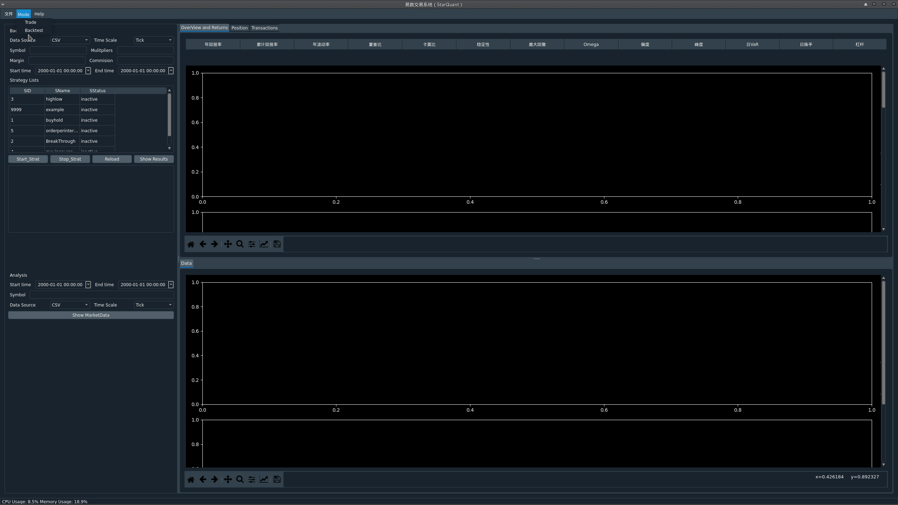
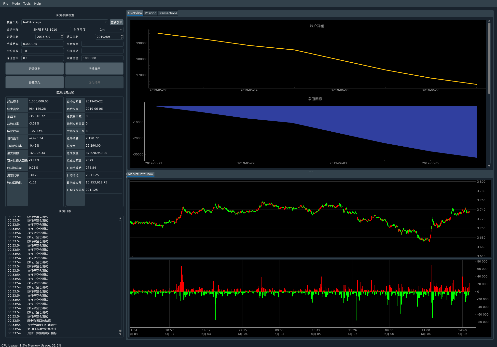

Welcome to StarQuant
==================

<p align="left">
   
   
    
    
    
    
</p>

[English](README_eng.md) 


**StarQuant**(中文名：易数交易系统)是一个轻量的、面向个人( 普通）用户的综合量化交易回测系统，目前主要用于期货期权程序化交易，后期会考虑加入股票交易的功能。
当前进展：开发已完成三分之一左右。


## 功能特色
*  支持python语言的策略回测，回测框架是python实现，事件驱动模式，策略在回测和交易程序中形式一样，无需重写代码, 同时python策略的数据格式、函数形式与vnpy一致，方便转换和迁移；
* 支持实盘行情订阅和数据存储，支持实盘行情数据的模拟交易（简单的撮合）；
* 支持实盘程序化交易，支持多个API接口（ctp, xtp，易盛内外盘等），支持多个账号同时登录， 多个策略独立运行，可设置触发条件实现自动登录，登出，重置等，可以实现7*24小时工作；
* 具有可视化界面作为前端，方便监控和操作；
* 支持系统、交易信息（委托，成交，持仓等）的记录。
* 采用多进程和多线程模式，行情交易接口，策略执行，gui界面均为独立进程，进程之间通信延迟在百微秒量级（实测在30-100微秒之间），并可设置cpu亲和性实现绑核。
*  支持微信实时推送和接收信息（itchat 或Server酱等方式)
 
## 系统架构
 
系统主框架基于c++实现，采用c-s架构，基于事件驱动模式，采用模块化松耦合设计，服务端的行情，交易、数据记录为单独线程，服务端与gui界面、策略之间的进程通信采用消息队列方式（nanomsg），行情数据可以通过相关端口以消息形式转发到策略进程，策略下单操作也通过相关端口将指令转发到服务端，然后调用相关柜台api，行情api支持CTP，TAP等，数据可以记录到本地（csv文件或Mongodb数据库），策略可以采用python或c++实现。GUI是基于PyQt5，支持手动交易，策略交易，委托持仓账号等信息查看。

注：开源的代码主要展示了系统的原型和框架，方便在此基础上二次开发和定制，定制化的代码未开源。


## 开发环境
本系统在开发过程中参考了已有的开源软件vnpy,kungfu，EliteQuant等。
开发环境：Manjaro（arch，Linux内核4.14)，python 3.7.2，gcc 8.2
第三方库：
boost 1.69
nanomsg
log4cplus
yamlcpp
libmongoc-1.0

python依赖psutil，pyyaml,pyqt,qdarkstyle,tushare等包。

## 运行


首先需要编译完成cppsrc下的库，需要事先安装boost，nanomsg以及CTP,TAP等柜台api的动态链接库。
编译过程和原项目类似，使用 [CMake](https://cmake.org) 进行编译：

```
$ cd cppsur
$ mkdir build
$ cd build
$ cmake ..
$ make
```
编译完成后将cppsrc/build/StarQuant下的可执行文件sqserver拷贝到主目录运行即可启动服务端，
gui界面执行sqgui.py即可启动，backtest.py为回测执行文件，config_*.yaml为相应的配置文件，运行前请修改并且放到etc文件夹下
mystrategy为相应的策略文件夹，其中策略可以单独运行

## 编写约定
-------------------
参考google 的c++ guide
变量命名：类名采用驼峰式，单词首字母大写，不包含_字符；类成员变量字母一般小写，后加_，如data_,全局变量加g_修饰，函数一般大小写混合形式。


## 使用说明
-------
品种符号约定：
  采用全名的形式：交易所 类型 商品名 合约，如SHFE F RB 1905
  对于ctp，程序内部api会转换为对应的简写形式，rb1905，
行情、交易、策略之间消息传递的格式：消息头|消息内容
 消息头:目的地|源地址|类型，类型有：
 
 消息内容：对应类型的数据

 
## Demo
-----------







## TODO

本系统尚在开发过程中，当前大约完成了30%左右的功能。
TODO:
1. 完善实盘下控制功能和各种常见事件（msg)的处理（40%）
2. 增加实盘下异常处理和检测（50%）
4. 完善回测系统，包括持仓、保证金的计算、每日结算、结果的展示,优化等（70%）
5. 完善gui，包括实时行情，资金曲线的绘制，数据的存储等（80%）
6. 跨平台支持（100%）


